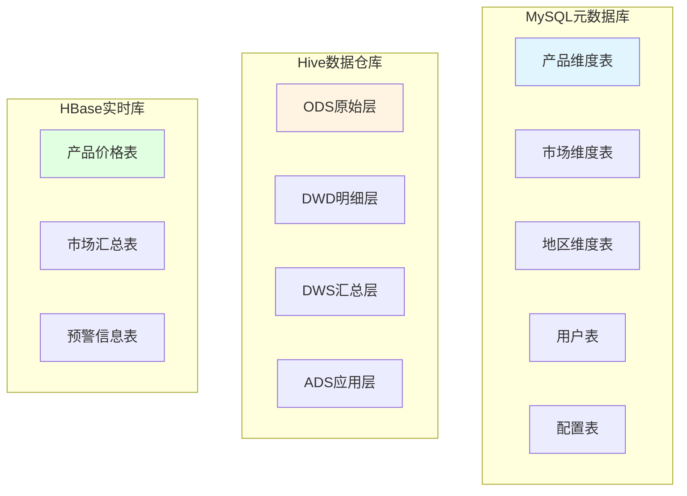

# 数据库设计文档

## 1. 数据库设计概述

### 1.1 设计原则
- **分层设计**：采用ODS、DWD、DWS、ADS四层数据仓库架构
- **分区策略**：按时间、地区等维度进行分区，提升查询性能
- **存储优化**：使用ORC列式存储格式，配合Snappy压缩
- **索引优化**：合理设计索引，加速热点查询

### 1.2 数据库架构



---

## 2. MySQL 元数据库设计

### 2.1 产品维度表 (dim_product)

| 字段名 | 类型 | 长度 | 允许空 | 默认值 | 说明 |
|--------|------|------|--------|--------|------|
| product_id | VARCHAR | 32 | N | - | 产品ID（主键） |
| product_name | VARCHAR | 100 | N | - | 产品名称 |
| category_id | VARCHAR | 16 | N | - | 分类ID |
| category_name | VARCHAR | 50 | N | - | 分类名称 |
| spec | VARCHAR | 50 | Y | - | 规格 |
| unit | VARCHAR | 10 | N | - | 单位（千克/斤） |
| description | TEXT | - | Y | - | 产品描述 |
| is_active | TINYINT | 1 | N | 1 | 是否启用 |
| create_time | DATETIME | - | N | NOW() | 创建时间 |
| update_time | DATETIME | - | N | NOW() | 更新时间 |

**索引设计：**
- PRIMARY KEY (product_id)
- INDEX idx_category (category_id)
- INDEX idx_name (product_name)

### 2.2 市场维度表 (dim_market)

| 字段名 | 类型 | 长度 | 允许空 | 默认值 | 说明 |
|--------|------|------|--------|--------|------|
| market_id | VARCHAR | 32 | N | - | 市场ID（主键） |
| market_name | VARCHAR | 100 | N | - | 市场名称 |
| market_type | VARCHAR | 20 | N | - | 市场类型（批发/零售） |
| region_id | VARCHAR | 16 | N | - | 地区ID |
| address | VARCHAR | 200 | Y | - | 详细地址 |
| latitude | DECIMAL | 10,6 | Y | - | 纬度 |
| longitude | DECIMAL | 10,6 | Y | - | 经度 |
| contact | VARCHAR | 50 | Y | - | 联系方式 |
| is_active | TINYINT | 1 | N | 1 | 是否启用 |
| create_time | DATETIME | - | N | NOW() | 创建时间 |
| update_time | DATETIME | - | N | NOW() | 更新时间 |

**索引设计：**
- PRIMARY KEY (market_id)
- INDEX idx_region (region_id)
- INDEX idx_type (market_type)

### 2.3 地区维度表 (dim_region)

| 字段名 | 类型 | 长度 | 允许空 | 默认值 | 说明 |
|--------|------|------|--------|--------|------|
| region_id | VARCHAR | 16 | N | - | 地区ID（主键） |
| region_name | VARCHAR | 50 | N | - | 地区名称 |
| province | VARCHAR | 20 | N | - | 省份 |
| city | VARCHAR | 20 | N | - | 城市 |
| district | VARCHAR | 20 | Y | - | 区县 |
| level | TINYINT | 1 | N | - | 行政级别 |
| parent_id | VARCHAR | 16 | Y | - | 上级地区ID |
| create_time | DATETIME | - | N | NOW() | 创建时间 |

**索引设计：**
- PRIMARY KEY (region_id)
- INDEX idx_province (province)
- INDEX idx_city (city)
- INDEX idx_parent (parent_id)

### 2.4 用户表 (sys_user)

| 字段名 | 类型 | 长度 | 允许空 | 默认值 | 说明 |
|--------|------|------|--------|--------|------|
| user_id | VARCHAR | 32 | N | - | 用户ID（主键） |
| username | VARCHAR | 50 | N | - | 用户名 |
| password | VARCHAR | 100 | N | - | 密码（加密） |
| real_name | VARCHAR | 50 | Y | - | 真实姓名 |
| email | VARCHAR | 100 | Y | - | 邮箱 |
| phone | VARCHAR | 20 | Y | - | 手机号 |
| role_id | VARCHAR | 16 | N | - | 角色ID |
| status | TINYINT | 1 | N | 1 | 状态（1启用/0禁用） |
| last_login_time | DATETIME | - | Y | - | 最后登录时间 |
| create_time | DATETIME | - | N | NOW() | 创建时间 |
| update_time | DATETIME | - | N | NOW() | 更新时间 |

**索引设计：**
- PRIMARY KEY (user_id)
- UNIQUE KEY uk_username (username)
- INDEX idx_email (email)

### 2.5 系统配置表 (sys_config)

| 字段名 | 类型 | 长度 | 允许空 | 默认值 | 说明 |
|--------|------|------|--------|--------|------|
| config_key | VARCHAR | 100 | N | - | 配置键（主键） |
| config_value | TEXT | - | Y | - | 配置值 |
| config_type | VARCHAR | 20 | N | - | 配置类型 |
| description | VARCHAR | 200 | Y | - | 配置描述 |
| create_time | DATETIME | - | N | NOW() | 创建时间 |
| update_time | DATETIME | - | N | NOW() | 更新时间 |

**索引设计：**
- PRIMARY KEY (config_key)

---

## 3. Hive 数据仓库设计

### 3.1 ODS层 - 原始数据层

#### 3.1.1 原始价格数据表 (ods_agri_price_raw)

```sql
CREATE EXTERNAL TABLE ods_agri_price_raw (
    raw_data STRING COMMENT '原始JSON数据',
    crawl_time TIMESTAMP COMMENT '抓取时间',
    source STRING COMMENT '数据来源',
    data_version STRING COMMENT '数据版本',
    status STRING COMMENT '处理状态'
) 
PARTITIONED BY (dt STRING COMMENT '日期分区')
STORED AS ORC
TBLPROPERTIES (
    'orc.compress'='SNAPPY',
    'orc.create.index'='true'
);
```

#### 3.1.2 原始日志表 (ods_crawler_log)

```sql
CREATE EXTERNAL TABLE ods_crawler_log (
    log_id STRING COMMENT '日志ID',
    crawler_name STRING COMMENT '爬虫名称',
    url STRING COMMENT '请求URL',
    status STRING COMMENT '状态',
    error_msg STRING COMMENT ' '错误信息',
    duration BIGINT COMMENT '耗时(ms)',
    log_time TIMESTAMP COMMENT '日志时间'
) 
PARTITIONED BY (dt STRING COMMENT '日期分区')
STORED AS ORC
TBLPROPERTIES (
    'orc.compress'='SNAPPY'
);
```

### 3.2 DWD层 - 明细数据层

#### 3.2.1 产品价格明细表 (dwd_agri_price_detail)

```sql
CREATE TABLE dwd_agri_price_detail (
    price_id STRING COMMENT '价格ID',
    product_id STRING COMMENT '产品ID',
    product_name STRING COMMENT '产品名称',
    category_id STRING COMMENT '分类ID',
    market_id STRING COMMENT '市场ID',
    market_name STRING COMMENT '市场名称',
    region_id STRING COMMENT '地区ID',
    region_name STRING COMMENT '地区名称',
    avg_price DECIMAL(10,2) COMMENT '平均价格',
    wholesale_price DECIMAL(10,2) COMMENT '批发价',
    retail_price DECIMAL(10,2) COMMENT '零售价',
    highest_price DECIMAL(10,2) COMMENT '最高价',
    lowest_price DECIMAL(10,2) COMMENT '最低价',
    trade_volume DECIMAL(15,2) COMMENT '交易量',
    trade_date DATE COMMENT '交易日期',
    crawl_time TIMESTAMP COMMENT '抓取时间',
    source STRING COMMENT '数据来源',
    data_quality_score DECIMAL(3,2) COMMENT '数据质量评分'
) 
PARTITIONED BY (year STRING, month STRING)
STORED AS ORC
TBLPROPERTIES (
    'orc.compress'='SNAPPY',
    'orc.create.index'='true',
    'orc.stripe.size'='67108864'
);
```

#### 3.2.2 价格变化明细表 (dwd_price_change_detail)

```sql
CREATE TABLE dwd_price_change_detail (
    change_id STRING COMMENT '变化ID',
    product_id STRING COMMENT '产品ID',
    region_id STRING COMMENT '地区ID',
    trade_date DATE COMMENT '交易日期',
    prev_price DECIMAL(10,2) COMMENT '前一日价格',
    curr_price DECIMAL(10,2) COMMENT '当日价格',
    price_change DECIMAL(10,2) COMMENT '价格变化',
    price_change_rate DECIMAL(5,2) COMMENT '价格变化率(%)',
    change_type STRING COMMENT '变化类型(上涨/下跌/持平)'
) 
PARTITIONED BY (year STRING, month STRING)
STORED AS ORC
TBLPROPERTIES (
    'orc.compress'='SNAPPY'
);
```

### 3.3 DWS层 - 汇总数据层

#### 3.3.1 每日价格汇总表 (dws_price_daily_summary)

```sql
CREATE TABLE dws_price_daily_summary (
    summary_date DATE COMMENT '汇总日期',
    product_id STRING COMMENT '产品ID',
    region_id STRING COMMENT '地区ID',
    avg_price DECIMAL(10,2) COMMENT '平均价格',
    max_price DECIMAL(10,2) COMMENT '最高价格',
    min_price DECIMAL(10,2) COMMENT '最低价格',
    price_std DECIMAL(10,2) COMMENT '价格标准差',
    total_volume DECIMAL(15,2) COMMENT '总交易量',
    market_count INT COMMENT '市场数量',
    price_trend STRING COMMENT '价格趋势'
) 
PARTITIONED BY (year STRING, month STRING)
STORED AS ORC
TBLPROPERTIES (
    'orc.compress'='SNAPPY'
);
```

#### 3.3.2 每月价格汇总表 (dws_price_monthly_summary)

```sql
CREATE TABLE dws_price_monthly_summary (
    summary_year INT COMMENT '汇总年份',
    summary_month INT COMMENT '汇总月份',
    product_id STRING COMMENT '产品ID',
    region_id STRING COMMENT '地区ID',
    month_avg_price DECIMAL(10,2) COMMENT '月均价格',
    month_max_price DECIMAL(10,2) COMMENT '月最高价',
    month_min_price DECIMAL(10,2) COMMENT '月最低价',
    month_start_price DECIMAL(10,2) COMMENT '月初价格',
    month_end_price DECIMAL(10,2) COMMENT '月末价格',
    month_change_rate DECIMAL(5,2) COMMENT '月变化率(%)',
    total_volume DECIMAL(15,2) COMMENT '月总交易量'
) 
PARTITIONED BY (year STRING)
STORED AS ORC
TBLPROPERTIES (
    'orc.compress'='SNAPPY'
);
```

#### 3.3.3 产品地区汇总表 (dws_product_region_summary)

```sql
CREATE TABLE dws_product_region_summary (
    product_id STRING COMMENT '产品ID',
    region_id STRING COMMENT '地区ID',
    year INT COMMENT '年份',
    quarter INT COMMENT '季度',
    quarter_avg_price DECIMAL(10,2) COMMENT '季度均价',
    quarter_max_price DECIMAL(10,2) COMMENT '季度最高价',
    quarter_min_price DECIMAL(10,2) COMMENT '季度最低价',
    price_volatility DECIMAL(5,2) COMMENT '价格波动率(%)',
    total_volume DECIMAL(15,2) COMMENT '总交易量'
) 
PARTITIONED BY (year STRING)
STORED AS ORC
TBLPROPERTIES (
    'orc.compress'='SNAPPY'
);
```

### 3.4 ADS层 - 应用数据层

#### 3.4.1 价格趋势分析表 (ads_price_trend_analysis)

```sql
CREATE TABLE ads_price_trend_analysis (
    product_id STRING COMMENT '产品ID',
    region_id STRING COMMENT '地区ID',
    analysis_date DATE COMMENT '分析日期',
    ma_7day DECIMAL(10,2) COMMENT '7日均线',
    ma_30day DECIMAL(10,2) COMMENT '30日均线',
    current_price DECIMAL(10,2) COMMENT '当前价格',
    price_position STRING COMMENT '价格位置(高位/中位/低位)',
    trend_direction STRING COMMENT '趋势方向(上升/下降/震荡)',
    trend_strength DECIMAL(3,2) COMMENT '趋势强度'
) 
PARTITIONED BY (region STRING)
STORED AS ORC
TBLPROPERTIES (
    'orc.compress'='SNAPPY'
);
```

#### 3.4.2 价格预警表 (ads_price_alert)

```sql
CREATE TABLE ads_price_alert (
    alert_id STRING COMMENT '预警ID',
    product_id STRING COMMENT '产品ID',
    product_name STRING COMMENT '产品名称',
    region_id STRING COMMENT '地区ID',
    region_name STRING COMMENT '地区名称',
    alert_time TIMESTAMP COMMENT '预警时间',
    alert_level STRING COMMENT '预警级别(一级/二级/三级)',
    alert_type STRING COMMENT '预警类型(暴涨/暴跌/异常)',
    current_date DATE COMMENT '当前日期',
    current_price DECIMAL(10,2) COMMENT '当前价格',
    normal_range_min DECIMAL(10,2) COMMENT '正常范围最小值',
    normal_range_max DECIMAL(10,2) COMMENT '正常范围最大值',
    deviation_rate DECIMAL(5,2) COMMENT '偏离度(%)',
    predicted_price DECIMAL(10,2) COMMENT '预测价格',
    prediction_error DECIMAL(5,2) COMMENT '预测误差(%)',
    is_handled TINYINT COMMENT '是否处理',
    handle_time TIMESTAMP COMMENT '处理时间',
    handle_result STRING COMMENT '处理结果'
) 
STORED AS ORC
TBLPROPERTIES (
    'orc.compress'='SNAPPY'
);
```

#### 3.4.3 价格预测结果表 (ads_price_prediction)

```sql
CREATE TABLE ads_price_prediction (
    prediction_id STRING COMMENT '预测ID',
    product_id STRING COMMENT '产品ID',
    region_id STRING COMMENT '地区ID',
    model_name STRING COMMENT '模型名称',
    model_version STRING COMMENT '模型版本',
    train_end_date DATE COMMENT '训练结束日期',
    predict_date DATE COMMENT '预测日期',
    predicted_price DECIMAL(10,2) COMMENT '预测价格',
    confidence_lower DECIMAL(10,2) COMMENT '置信区间下限',
    confidence_upper DECIMAL(10,2) COMMENT '置信区间上限',
    confidence_level DECIMAL(3,2) COMMENT '置信水平',
    prediction_time TIMESTAMP COMMENT '预测时间'
) 
PARTITIONED BY (year STRING, month STRING)
STORED AS ORC
TBLPROPERTIES (
    'orc.compress'='SNAPPY'
);
```

#### 3.4.4 市场价格对比表 (ads_market_price_comparison)

```sql
CREATE TABLE ads_market_price_comparison (
    comparison_date DATE COMMENT '对比日期',
    product_id STRING COMMENT '产品ID',
    region_id STRING COMMENT '地区ID',
    national_avg_price DECIMAL(10,2) COMMENT '全国均价',
    regional_avg_price DECIMAL(10,2) COMMENT '地区均价',
    price_diff DECIMAL(10,2) COMMENT '价格差',
    price_diff_rate DECIMAL(5,2) COMMENT '价格差异率(%)',
    price_rank INT COMMENT '价格排名',
    total_regions INT COMMENT '总地区数'
) 
PARTITIONED BY (year STRING, month STRING)
STORED AS ORC
TBLPROPERTIES (
    'orc.compress'='SNAPPY'
);
```

---

## 4. HBase 实时数据库设计

### 4.1 产品价格实时表 (product_price)

| RowKey | 列族 | 列限定符 | 说明 |
|--------|------|----------|------|
| product_id_region_date | info | avg_price | 平均价格 |
| | info | wholesale_price | 批发价 |
| | info | retail_price | 零售价 |
| | info | highest_price | 最高价 |
| | info | | 最低价 |
| | info | trade_volume | 交易量 |
| | info | update_time | 更新时间 |

**RowKey设计：** `product_id + "_" + region_id + "_" + date`

### 4.2 市场汇总表 (market_summary)

| RowKey | 列族 | 列限定符 | 说明 |
|--------|------|----------|------|
| market_id_date | info | product_count | 产品数量 |
| | info | avg_price | 平均价格 |
| | info | total_volume | 总交易量 |
| | info | update_time | 更新时间 |

**RowKey设计：** `market_id + "_" + date`

### 4.3 预警信息表 (alert_info)

| RowKey | 列族 | 列限定符 | 说明 |
|--------|------|----------|------|
| alert_id | info | product_id | 产品ID |
| | info | region_id | 地区ID |
| | info | alert_level | 预警级别 |
| | info | alert_time | 预警时间 |
| | info | current_price | 当前价格 |
| | info | deviation_rate | 偏离