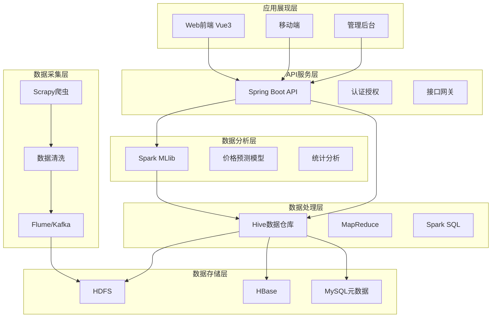
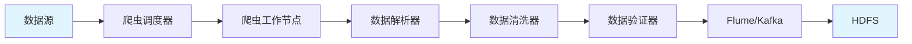
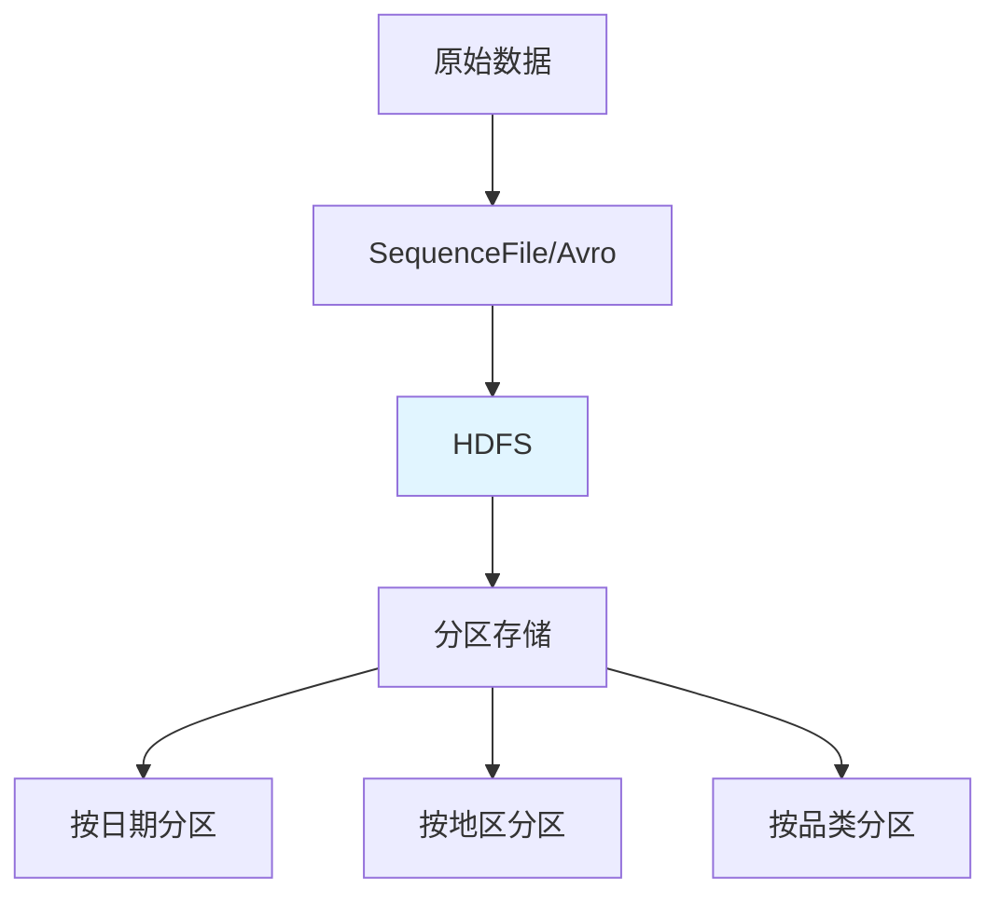
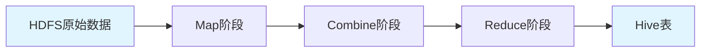
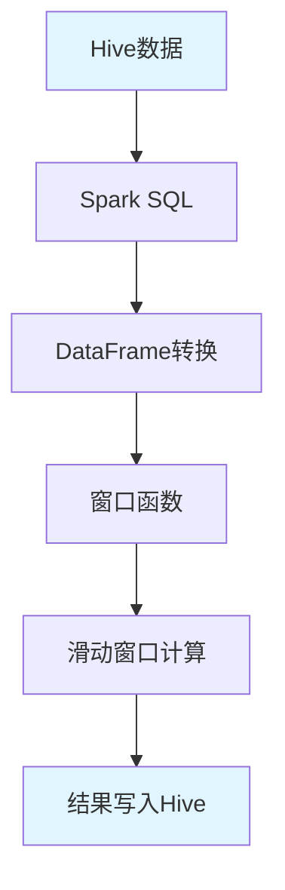
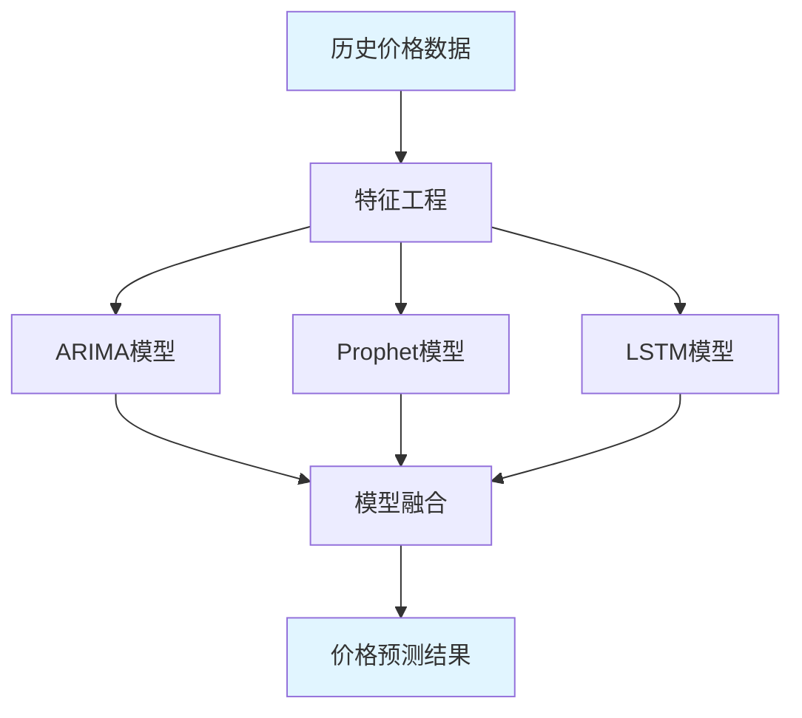
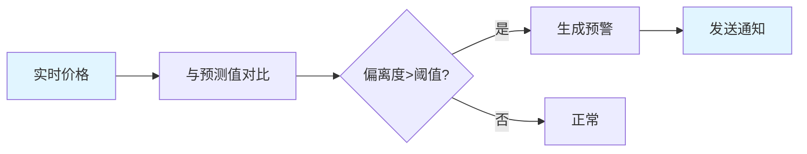
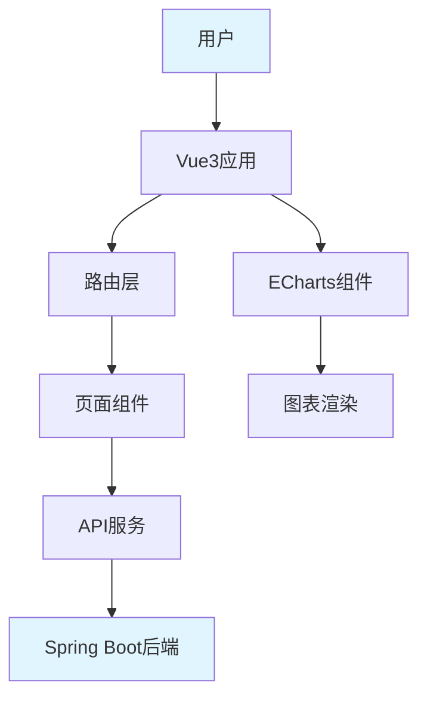
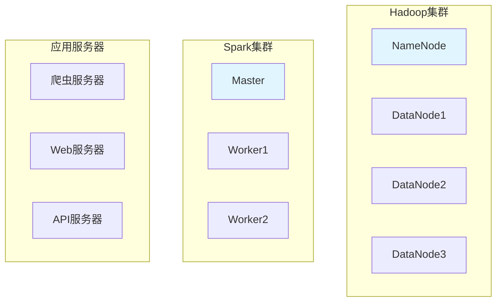

# 基于Hadoop的贵州农产品价格监测分析系统 - 系统架构设计

## 1. 项目概述

### 1.1 项目背景
本项目旨在设计并实现一个基于Hadoop的贵州农产品价格监测分析系统，通过爬虫技术抓取电商平台和农业信息网关于贵州农产品的信息数据，利用Hadoop生态进行数据存储、处理和分析，解决传统农产品价格监测依赖人工采集与局部统计的问题。

### 1.2 系统目标
- 实现农产品价格信息的实时收集、存储、处理和分析
- 为农产品买家和平台运营者提供全面的价格信息和趋势预测
- 提高市场信息透明度，帮助买家和卖家做出合理的交易决策
- 打破信息不对称，促进市场公平竞争，保护消费者权益

### 1.3 核心功能
1. **数据采集功能**：通过爬虫技术抓取电商平台和农业信息网的价格数据
2. **数据存储功能**：利用HDFS存储大规模农产品价格信息数据
3. **数据处理功能**：使用MapReduce/Spark进行数据处理和分析
4. **数据分析功能**：基于Spark MLlib构建价格预测模型
5. **数据可视化功能**：利用ECharts等可视化工具生成价格信息可视化图表

---

## 2. 系统整体架构

### 2.1 分层架构设计

系统采用五层架构设计，各层职责清晰，通过标准接口进行交互：



### 2.2 技术栈选型

| 层级 | 技术组件 | 说明 |
|------|----------|------|
| **数据采集层** | Python + Scrapy | 分布式爬虫框架 |
| | Scrapy-Redis | 分布式爬虫调度 |
| | Selenium/Playwright | 动态页面渲染 |
|) | Flume/Kafka | 数据接入中间件 |
| **数据存储层** | Hadoop HDFS | 分布式文件系统 |
| | HBase | NoSQL数据库 |
| | MySQL | 元数据存储 |
| **数据处理层** | Hive | 数据仓库 |
| | MapReduce | 批处理计算 |
| | Spark SQL | 快速查询分析 |
| **数据分析层** | Spark MLlib | 机器学习库 |
| | ARIMA/Prophet | 时间序列预测 |
| | TensorFlow/PyTorch | 深度学习 |
| **API服务层** | Spring Boot | 后端服务框架 |
| | MyBatis/JPA | ORM框架 |
| | Redis | 缓存 |
| **应用展现层** | Vue3 | 前端框架 |
| | Element Plus | UI组件库 |
| | ECharts | 数据可视化 |

---

## 3. 数据采集模块架构

### 3.1 模块设计



### 3.2 核心组件

#### 3.2.1 爬虫调度器 (Crawler Scheduler)
- **功能**：管理爬虫任务队列，分配任务给工作节点
- **技术**：Scrapy-Redis + Redis
- **职责**：
  - 维护待抓取URL队列
  - 去重处理
  - 任务分发
  - 失败重试

#### 3.2.2 爬虫工作节点 (Crawler Worker)
- **功能**：执行具体的爬取任务
- **技术**：Scrapy + Selenium
- **职责**：
  - 发送HTTP请求
  - 处理反爬机制（代理池、User-Agent轮换）
  - 解析HTML/JSON数据
  - 提取农产品价格信息

#### 3.2.3 数据清洗器 (Data Cleaner)
- **功能**：对原始数据进行标准化处理
- **职责**：
  - 单位换算（统一为元/公斤）
  - 日期格式标准化
  - 异常值识别与剔除
  - 缺失值填充

#### 3.2.4 数据验证器 (Data Validator)
- **功能**：验证数据质量
- **职责**：
  - 数据完整性检查
  - 数据范围验证
  - 数据一致性检查

### 3.3 数据源配置

| 数据源类型 | 示例网站 | 数据格式 | 更新频率 |
|------------|----------|----------|----------|
| 电商平台 | 淘宝、京东、拼多多 | JSON/HTML | 实时 |
| 农业信息网 | 贵州省农业农村厅 | HTML | 每日 |
| 批发市场 | 新发地、贵阳农产品批发市场 | HTML/JSON | 每日 |
| 政府公示 | 国家统计局 | HTML/JSON | 每月 |

### 3.4 数据实体设计

```python
# 农产品价格数据实体
class AgriculturalProductPrice:
    product_id: str          # 产品ID
    product_name: str        # 产品名称
    category: str            # 分类（蔬菜、水果、畜产等）
    spec: str                # 规格（一级、二级）
    unit: str                # 单位（千克/斤）
    wholesale_price: float   # 批发价
    retail_price: float      # 零售价
    highest_price: float     # 最高价
    lowest_price: float      # 最低价
    market_id: str           # 市场ID
    market_name: str         # 市场名称
    region: str              # 地区
    latitude: float          # 纬度
    longitude: float         # 经度
    trade_date: date         # 交易日期
    crawl_time: datetime     # 抓取时间
    source: str              # 数据来源
```

---

## 4. 数据存储层架构

### 4.1 HDFS存储策略



### 4.2 Hive数据仓库设计

采用星型模型构建数据仓库，分为四层：

#### 4.2.1 ODS层 (原始数据层)
```sql
CREATE TABLE ods_agri_price_raw (
    raw_data STRING,
    crawl_time TIMESTAMP,
    source STRING,
    data_version STRING
) PARTITIONED BY (dt STRING)
STORED AS ORC;
```

#### 4.2.2 DWD层 (明细数据层)
```sql
CREATE TABLE dwd_agri_price_detail (
    product_id STRING,
    product_name STRING,
    category_id STRING,
    market_id STRING,
    region_id STRING,
    avg_price DECIMAL(10,2),
    wholesale_price DECIMAL(10,2),
    retail_price DECIMAL(10,2),
    highest_price DECIMAL(10,2),
    lowest_price DECIMAL(10,2),
    trade_volume DECIMAL(15,2),
    trade_date DATE,
    crawl_time TIMESTAMP
) PARTITIONED BY (year STRING, month STRING)
STORED AS ORC
TBLPROPERTIES ('orc.compress'='SNAPPY');
```

#### 4.2.3 DIM层 (维度表)
```sql
-- 产品维度表
CREATE TABLE dim_product (
    product_id STRING,
    product_name STRING,
    category_id STRING,
    spec STRING,
    unit STRING,
    description STRING
) STORED AS ORC;

-- 市场维度表
CREATE TABLE dim_market (
    market_id STRING,
    market_name STRING,
    region_id STRING,
    address STRING,
    latitude DECIMAL(10,6),
    longitude DECIMAL(10,6)
) STORED AS ORC;

-- 地区维度表
CREATE TABLE dim_region (
    region_id STRING,
    region_name STRING,
    province STRING,
    city STRING,
    district STRING
) STORED AS ORC;
```

#### 4.2.4 ADS层 (应用数据层)
```sql
-- 每日价格趋势表
CREATE TABLE ads_price_trends_daily (
    region_id STRING,
    product_id STRING,
    trade_date DATE,
    avg_price DECIMAL(10,2),
    price_change DECIMAL(10,2),
    price_change_rate DECIMAL(5,2),
    volume DECIMAL(15,2)
) PARTITIONED BY (region STRING)
STORED AS ORC;

-- 价格预警表
CREATE TABLE ads_price_alert (
    alert_id STRING,
    product_id STRING,
    region_id STRING,
    alert_time TIMESTAMP,
    alert_level STRING,
    current_price DECIMAL(10,2),
    normal_range_min DECIMAL(10,2),
    normal_range_max DECIMAL(10,2),
    deviation_rate DECIMAL(5,2)
) STORED AS ORC;
```

### 4.3 HBase设计

用于存储实时查询数据：

| 表名 | RowKey | 列族 | 说明 |
|------|--------|------|------|
| product_price | product_id_region_date | info | 产品价格实时数据 |
| market_summary | market_id_date | info | 市场汇总数据 |

---

## 5. 数据处理层架构

### 5.1 MapReduce处理流程



#### 5.1.1 加权平均价格计算
- **Map阶段**：以（省份_产品品类）作为Key，以（成交价格 × 成交量，成交量）作为Value
- **Combine阶段**：在Map端局部合并，减少网络传输
- **Reduce阶段**：对相同Key的所有Value进行累加，计算总金额除以总成交量

### 5.2 Spark处理流程



#### 5.2.1 7日滚动平均价计算
```python
# Spark滑动窗口计算示例
from pyspark.sql import Window
from pyspark.sql.functions import avg, col

window_spec = Window.partitionBy("product_id") \
                   .orderBy("trade_date") \
                   .rowsBetween(-6, 0)

df_with_ma = df.withColumn("ma_7day", avg("avg_price").over(window_spec))
```

#### 5.2.2 数据倾斜处理策略
- **加盐（Salting）**：在Key上增加随机前缀，将热点数据分散
- **预聚合**：在Map端通过Combiner进行初步累加

---

## 6. 数据分析层架构

### 6.1 价格预测模型



### 6.2 模型选择

| 模型类型 | 适用场景 | 优势 | 劣势 |
|----------|----------|------|------|
| ARIMA | 单变量时间序列 | 理论成熟，解释性强 | 难以处理多重季节性 |
| Prophet | 含节假日效应的数据 | 自动处理季节性 | 计算资源消耗大 |
| LSTM | 多变量复杂关系 | 捕捉非线性依赖 | 需要大量数据训练 |

### 6.3 特征工程

#### 6.3.1 时间特征
- 年、月、日、星期几
- 是否节假日
- 季节标识

#### 6.3.2 价格特征
- 历史价格（1日、7日、30日）
- 价格变化率
- 移动平均
- 波动率

#### 6.3.3 外部特征
- 气象数据（温度、降水）
- 物流成本指数
- 相关产品价格（饲料价格与生猪价格）

### 6.4 预警机制



#### 6.4.1 预警级别
- **一级预警**：价格偏离度 > 50%
- **二级预警**：价格偏离度 > 30%
- **三级预警**：价格偏离度 > 15%

---

## 7. 可视化展示层架构

### 7.1 前端架构



### 7.2 核心页面设计

#### 7.2.1 数据看板
- 价格空间分布图（GIS地图热力图）
- 价格趋势对比图（同比/环比分析）
- 预警雷达图
- 关联性分析矩阵

#### 7.2.2 价格查询
- 按产品查询
- 按地区查询
- 按时间范围查询
- 多维度组合查询

#### 7.2.3 预测分析
- 价格趋势预测
- 波动风险分析
- 市场供需分析

### 7.3 可视化组件

| 图表类型 | 用途 | 数据维度 |
|----------|------|----------|
| 折线图 | 价格趋势 | 时间、价格 |
| 柱状图 | 价格对比 | 产品、地区 |
| 热力图 | 价格分布 | 地区、价格强度 |
| 雷达图 | 预警指标 | 多维度指标 |
| 散点图 | 相关性分析 | 两个变量 |

---

## 8. API接口设计

### 8.1 RESTful API规范

| 方法 | 路径 | 说明 |
|------|------|------|
| GET | /api/v1/price/trend | 获取价格趋势 |
| GET | /api/v1/price/current | 获取当前价格 |
| GET | /api/v1/market/list | 获取市场列表 |
| GET | /api/v1/product/list | 获取产品列表 |
| GET | /api/v1/alert/list | 获取预警列表 |
| GET | /api/v1/predict/{productId} | 获取价格预测 |
| GET | /api/v1/report/export | 导出分析报告 |

### 8.2 API响应格式

```json
{
  "code": 200,
  "message": "success",
  "data": {
    // 具体数据
  },
  "timestamp": "2026-02-07T08:00:00Z"
}
```

---

## 9. 系统部署架构

### 9.1 集群规划



### 9.2 任务调度

使用Apache Airflow进行任务调度：

```mermaid
graph TB
    A[数据采集任务] --> B[数据清洗任务]
    B --> C[Hive导入任务]
    C --> D[Spark分析任务]
    D --> E[模型训练任务]
    E --> F[预警检测任务]
    F --> G[结果同步任务]
    
    style A fill:#e1